 **Digital** **Electronic** **Ovitrap:** Hardware and Construction Characteristics

André Luís Araújo Cotta – 22.2.8990 
Agustina Josefina Cruz - 26.1.0001

**1-** **General** **Description**

This document covers the technical and construction data regarding the
Digital Electronic Ovitrap, especially the embedded hardware and its
respective descriptions. The Digital Electronic Ovitrap is equipment
capable of collecting bio-acoustic audio samples of insects based on the
detection of their presence when entering a cavity containing
high-precision laser sensors. To perform the detection, organic baits
are deposited inside its central cavity to attract the insects; the bait
used in this project consists of a solution of brewer's yeast in water
in a proportion of 50mL of water to one tablespoon of brewer's yeast.
After placing the bait, the equipment is positioned in the area of
interest and left on for the storage of possible samples. The collected
samples are stored on an SD card and subsequently transmitted via
packets in a LoRaWAN network to be submitted to a central
post-processing server. Sample collection and storage are carried out by
an ESP32 microcontroller and modules attached to it, such as the INMP441
module, which consists of an omnidirectional MEMS microphone with native
digital output via I2S, and the MH-SD module, which is capable of
holding SD cards for reading and writing.

**Materials:**

12V Symmetric Power Supply 
2x IC LM311 (Schmitt Trigger) 
2x IC OP07 (OpAmp)

40x BPW34 (Photodiodes)

3x LM7805 (Voltage Regulator) 2x 10k Ohm Resistors

3x 1k Ohm Resistors 2x 10 Ohm Resistors 2x 200k Ohm Resistors

1x ESP32 WROOM 32 DEVKIT 1x INMP441 Module

1x MH-SD Module 1x Green LED

1x Red LED

**2-** **Laser** **Detection** **Circuit**

The circuit for detecting the entry and exit of insects consists of
using photodiodes (BPW34) and Schmitt Trigger type circuits. Photodiodes
are electronic components

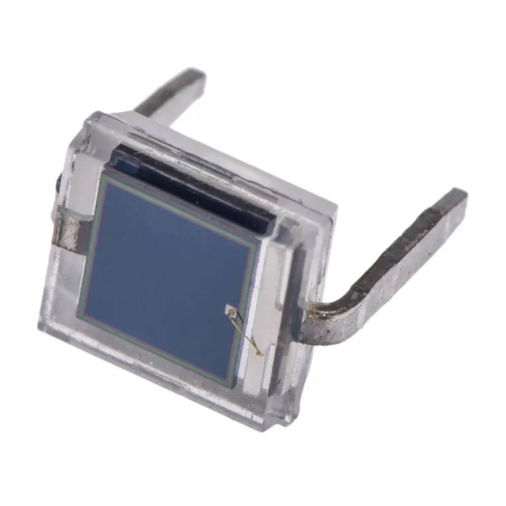

that, when subjected to light excitation at a given wavelength, conduct
electricity; in our case, the light excitation comes from lasers with
linear scattering centered on an array composed of 20 photodiodes.

When excited with the wavelength of light from the lasers, the
photodiodes enter conduction; thus, we connect a +12Vcc source at one
end of this array and at the other end, we use the resulting current in
a circuit topology known as a current-controlled voltage source, which
transforms and amplifies the resulting current from the excitation of
the photodiodes into a voltage with a corresponding amplitude.

> Figure 1 - Bpw34 and its sensitivity to wavelengths
>
> Figure 2 - View of the PCB to compose the two photodiode arrays

After this, this voltage is used in a Schmitt Trigger circuit, which
functions as a voltage level detector capable of returning a +5Vcc
signal at its output whenever the input signal reaches a set value. The
input signal of this circuit is analog and of very

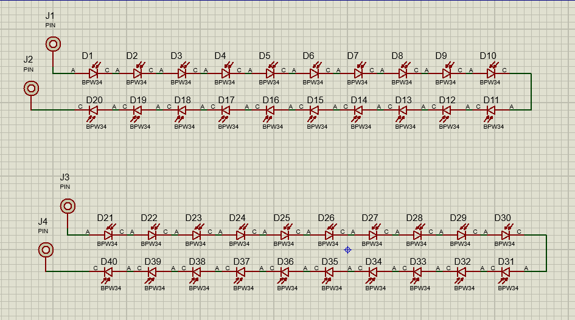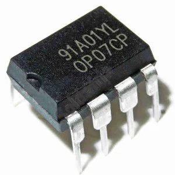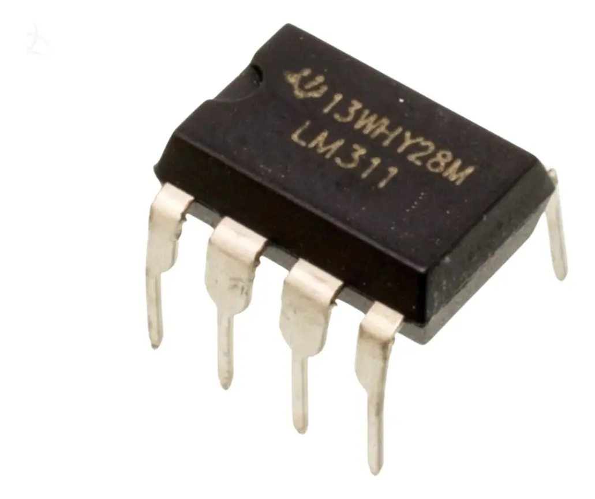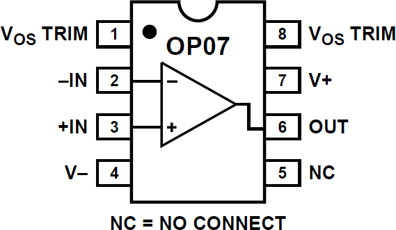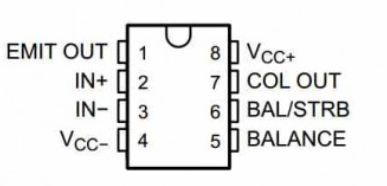

low amplitude, so the Schmitt trigger acts as an analog-to-digital
converter. To implement this circuit, the OP07 (Operational Amplifier)
and LM311 (Schmitt Trigger) integrated circuits were used.

> Figure 3 - Simulation schematic visualization of the two photodiode
> arrays
>
> Figure 5 - Integrated circuits used to compose the current-controlled
> voltage source and Schmitt trigger

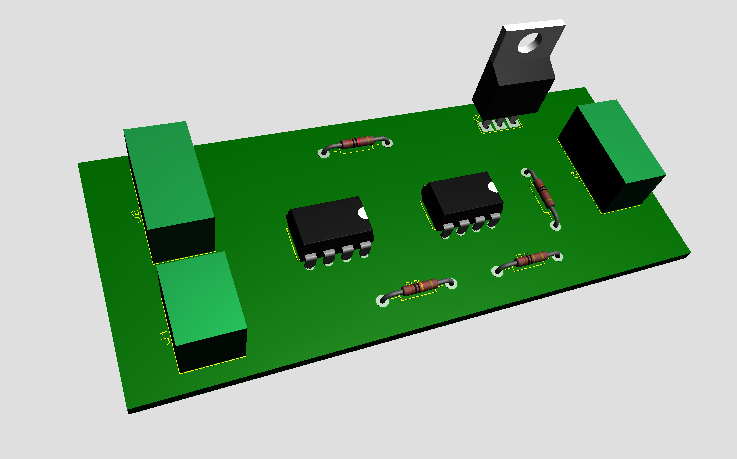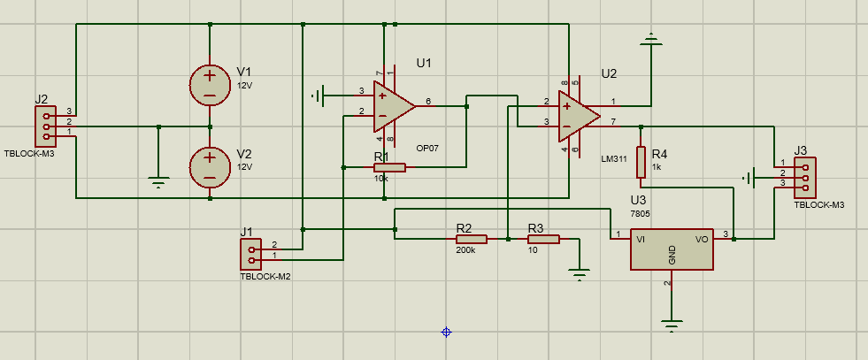

> Figure 6 - View of the PCB to compose the current-controlled voltage
> source and Schmitt trigger circuit
>
> Figure 7 - Simulation schematic visualization of the
> current-controlled voltage source and Schmitt trigger circuit

In this project, two copies of this set of circuits are used, one for
entry detection and another for exit, where depending on which sensor is
activated first, we determine whether it is an insect entry or exit
sample.

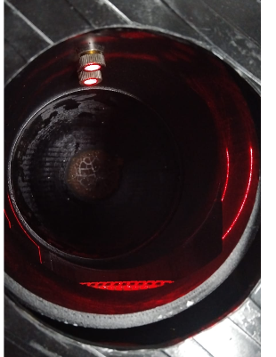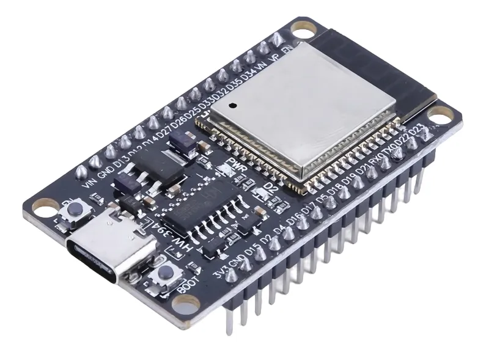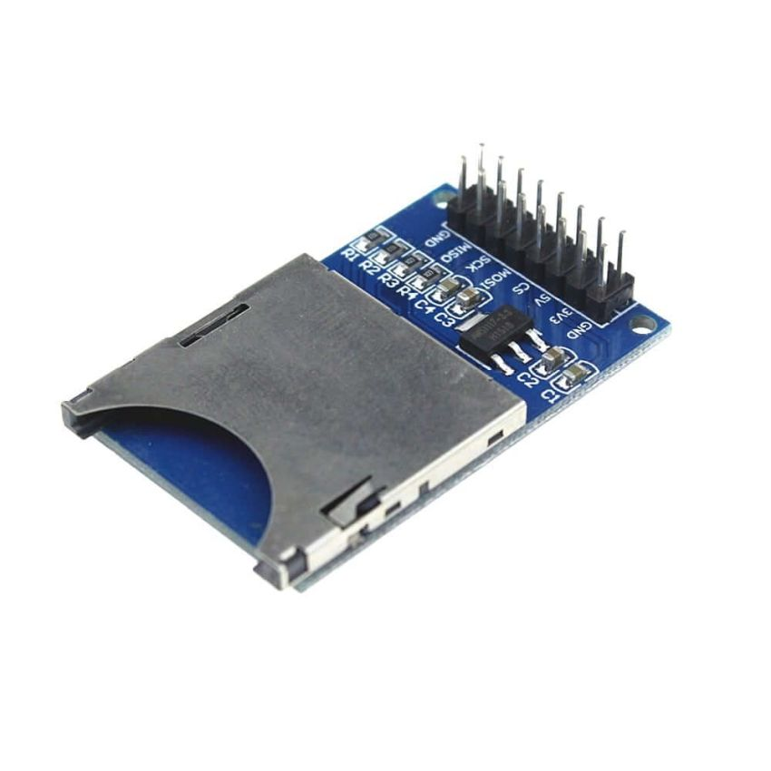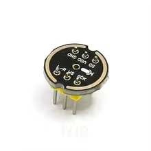

> Figure 8 - Inside of the detection cavity with detector circuits
> installed

**3-** **Sample** **Recording** **and** **Storage** **Circuit** **via**
**ESP32**

Sample collection consists of using the logic signal from the previous
circuit to serve as a trigger for an ESP32 microcontroller to record a
2-second audio sample through the INMP441 microphone and save it in a
sequential .wav file on the MH-SD module with a previously inserted SD
card.

> Figure 9 - ESP32 Wroom 32 DEVKIT, MH-SD and INMP441

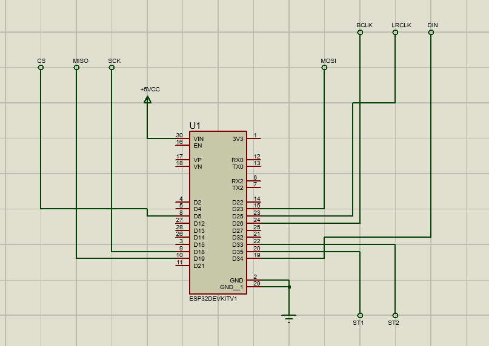

> Figure 10 - Pinout schematic for the sample recording circuit

O código desenvolvido para o dispositivo está anexado no apêndice A,
neste código utiliza-se o sinal proveniente do Schmitt Trigger nas
portas 33 e 34 para ativação da flag que executa a função de gravação de
áudio “recordAudio( )”. Dois leds podem ser ligados de maneira opcional
nas portas 17 e 16 para sinalização da detecção de entradas e saídas de
possíveis insetos.

**4-** **Sample** **Treatment**

The analysis of the samples is performed through a Python algorithm
present in Appendix B that performs the FFT of the signal present in the
.WAV file and measures the signal power in different frequency ranges in
which male and female mosquitoes may have possibly emitted the samples.
When analyzing a sample, the algorithm returns a graph containing the
analyzed frequency spectrum and the magnitude in each spectrum, so that
through visual inspection the user easily identifies the gender and
species of the sample.

> **Appendix** **A** **-** **Code** **Used** **in** **the** **ESP-32**
> **for** **Sample** **Collection**

\#include \<driver/i2s.h\> \#include "FS.h" \#include "SD.h" \#include
"SPI.h" \#include \<math.h\>

\#define I2S_PORT I2S_NUM_0

\#define RECORD_DURATION_SEC \#define SAMPLE_RATE

\#define BITS_PER_SAMPLE

\#define NUM_CHANNELS

2 16000

I2S_BITS_PER_SAMPLE_16BIT

1

const float GAIN_FACTOR = 700;

\#define BYTES_A_GRAVAR RECORD_DURATION_SEC)

\#define I2S_READ_BUFFER_SIZE

\#define TRIGGER_PIN1 \#define TRIGGER_PIN2

\#define I2S_BCLK \#define I2S_LRCLK \#define I2S_DIN

\#define SPI_MOSI \#define SPI_MISO \#define SPI_SCK

\#define SD_CS

(SAMPLE_RATE \* (16 / 8) \* NUM_CHANNELS \*

1024

33 35

26 25 34

23 19 18

5

int fileIndex = 0;

float b0_f, b1_f, b2_f, a1_f, a2_f; float x_n_1 = 0, x_n_2 = 0;

float y_n_1 = 0, y_n_2 = 0;

void calcularCoeficientesFiltro() { float fL = 300.0;

> float fH = 800.0;
>
> float fs = (float)SAMPLE_RATE;
>
> float fc = sqrt(fL \* fH); float BW = fH - fL;
>
> float Q = fc / BW;
>
> float w0 = 2.0 \* PI \* fc / fs; float alpha = sin(w0) / (2.0 \* Q);
>
> float a0 = 1.0 + alpha; b0_f = alpha / a0;
>
> b1_f = 0.0;
>
> b2_f = -alpha / a0;
>
> a1_f = (-2.0 \* cos(w0)) / a0; a2_f = (1.0 - alpha) / a0;
>
> Serial.println("Coeficientes do filtro passa-faixa configurados.");

}

void writeWavHeader(File file, long dataSize) { long fileSize =
dataSize + 44 - 8;

> long byteRate = SAMPLE_RATE \* NUM_CHANNELS \* (16 / 8); int
> blockAlign = NUM_CHANNELS \* (16 / 8);
>
> byte header\[44\];
>
> header\[0\] = 'R'; header\[1\] = 'I'; header\[2\] = 'F'; header\[3\] =
> 'F'; header\[4\] = (byte)(fileSize & 0xFF);
>
> header\[5\] = (byte)((fileSize \>\> 8) & 0xFF); header\[6\] =
> (byte)((fileSize \>\> 16) & 0xFF); header\[7\] = (byte)((fileSize \>\>
> 24) & 0xFF);
>
> header\[8\] = 'W'; header\[9\] = 'A'; header\[10\] = 'V'; header\[11\]
> = 'E';
>
> header\[12\] = 'f'; header\[13\] = 'm'; header\[14\] = 't';
> header\[15\] = ' '; header\[16\] = 16; header\[17\] = 0; header\[18\]
> = 0; header\[19\] = 0; header\[20\] = 1; header\[21\] = 0;
>
> header\[22\] = (byte)NUM_CHANNELS; header\[23\] = 0; header\[24\] =
> (byte)(SAMPLE_RATE & 0xFF); header\[25\] = (byte)((SAMPLE_RATE \>\> 8)
> & 0xFF); header\[26\] = (byte)((SAMPLE_RATE \>\> 16) & 0xFF);
> header\[27\] = (byte)((SAMPLE_RATE \>\> 24) & 0xFF); header\[28\] =
> (byte)(byteRate & 0xFF);
>
> header\[29\] = (byte)((byteRate \>\> 8) & 0xFF); header\[30\] =
> (byte)((byteRate \>\> 16) & 0xFF); header\[31\] = (byte)((byteRate
> \>\> 24) & 0xFF); header\[32\] = (byte)blockAlign; header\[33\] = 0;
> header\[34\] = (byte)16; header\[35\] = 0;
>
> header\[36\] = 'd'; header\[37\] = 'a'; header\[38\] = 't';
> header\[39\] = 'a'; header\[40\] = (byte)(dataSize & 0xFF);
>
> header\[41\] = (byte)((dataSize \>\> 8) & 0xFF); header\[42\] =
> (byte)((dataSize \>\> 16) & 0xFF); header\[43\] = (byte)((dataSize
> \>\> 24) & 0xFF);
>
> file.seek(0); file.write(header, 44);

}

void setupI2S() { i2s_config_t i2sConfig = {

> .mode = (i2s_mode_t)(I2S_MODE_MASTER \| I2S_MODE_RX), .sample_rate =
> SAMPLE_RATE,
>
> .bits_per_sample = BITS_PER_SAMPLE, .channel_format =
> I2S_CHANNEL_FMT_ONLY_LEFT, .communication_format =
> I2S_COMM_FORMAT_STAND_I2S, .intr_alloc_flags = ESP_INTR_FLAG_LEVEL1,
>
> .dma_buf_count = 8, .dma_buf_len = 64, .use_apll = false,
>
> .tx_desc_auto_clear = false, .fixed_mclk = 0
>
> };
>
> i2s_pin_config_t pinConfig = { .bck_io_num = I2S_BCLK, .ws_io_num =
> I2S_LRCLK,
>
> .data_out_num = I2S_PIN_NO_CHANGE, .data_in_num = I2S_DIN
>
> };
>
> i2s_driver_install(I2S_PORT, &i2sConfig, 0, NULL);
> i2s_set_pin(I2S_PORT, &pinConfig);

Serial.println("Driver I2S configurado."); }

void setupSD() {

> SPI.begin(SPI_SCK, SPI_MISO, SPI_MOSI, SD_CS); if (!SD.begin(SD_CS)) {
>
> Serial.println("Falha ao montar o cartão SD!"); while (1);
>
> }

Serial.println("Cartão SD montado com sucesso."); }

void recordAudio() {

> String filename = "/rec\_" + String(fileIndex++) + ".wav";
>
> File file = SD.open(filename, FILE_WRITE); if (!file) {
>
> Serial.println("Falha ao criar o arquivo no SD."); return;
>
> }
>
> Serial.print("Iniciando gravação: "); Serial.println(filename);
>
> byte dummyHeader\[44\]; file.write(dummyHeader, 44);
>
> uint8_t i2sBuffer\[I2S_READ_BUFFER_SIZE\]; long totalBytesGravados =
> 0;
>
> size_t bytesLidosDoI2S;
>
> x_n_1 = 0; x_n_2 = 0; y_n_1 = 0; y_n_2 = 0;
>
> while (totalBytesGravados \< BYTES_A_GRAVAR) {

int bytesParaLer = min((int)I2S_READ_BUFFER_SIZE, (int)(BYTES_A_GRAVAR
-totalBytesGravados));

i2s_read(I2S_PORT, i2sBuffer, bytesParaLer, &bytesLidosDoI2S,
portMAX_DELAY);

> int16_t\* samples = (int16_t\*)i2sBuffer; int num_samples =
> bytesLidosDoI2S / 2;
>
> for (int i = 0; i \< num_samples; i++) { float x_n =
> (float)samples\[i\];

float y_n = b0_f \* x_n + b1_f \* x_n_1 + b2_f \* x_n_2 - a1_f \*
y_n_1 - a2_f \* y_n_2;

> x_n_2 = x_n_1; x_n_1 = x_n; y_n_2 = y_n_1; y_n_1 = y_n;
>
> int32_t amostraProcessada = (int32_t)(y_n \* GAIN_FACTOR);
>
> if (amostraProcessada \> 32767) { amostraProcessada = 32767;
>
> } else if (amostraProcessada \< -32768) { amostraProcessada = -32768;
>
> }
>
> samples\[i\] = (int16_t)amostraProcessada; }
>
> file.write(i2sBuffer, bytesLidosDoI2S); totalBytesGravados +=
> bytesLidosDoI2S;
>
> }
>
> Serial.print("Gravação finalizada. Total de bytes: ");
> Serial.println(totalBytesGravados);
>
> writeWavHeader(file, totalBytesGravados); file.close();

Serial.println("Arquivo salvo."); }

void setup() { Serial.begin(115200);

> Serial.println("Iniciando...");
>
> pinMode(TRIGGER_PIN1, INPUT_PULLDOWN); pinMode(TRIGGER_PIN2,
> INPUT_PULLDOWN); pinMode(17, OUTPUT);
>
> pinMode(16, OUTPUT);
>
> setupI2S(); setupSD();
>
> calcularCoeficientesFiltro();

Serial.println("Sistema pronto. Aguardando gatilho no pino D33..."); }

void loop() { digitalWrite(17,LOW); digitalWrite(16,LOW);

> if(digitalRead(TRIGGER_PIN2) == LOW){ digitalWrite(17,HIGH);
> digitalWrite(16,HIGH); recordAudio();

} }

> **Appendix** **B** **-** **Code** **Used** **for** **Sample**
> **Processing**

import numpy as np import soundfile as sf

import matplotlib.pyplot as plt

caminho_arquivo = 'C:/Users/User/Documents/Audacity/rec_0.wav' y, Fs =
sf.read(caminho_arquivo)

if y.ndim \> 1:

> y = np.mean(y, axis=1)

\# 2. Calcular a FFT N = len(y)

Y = np.fft.fft(y)

f = np.arange(N) \* (Fs / N) half_N = N // 2

f = f\[:half_N\]

Y_mag = np.abs(Y\[:half_N\])

faixa_femea = (300, 450) faixa_macho = (550, 750)

idx_femea = np.where((f \>= faixa_femea\[0\]) & (f \<=
faixa_femea\[1\]))\[0\] idx_macho = np.where((f \>= faixa_macho\[0\]) &
(f \<= faixa_macho\[1\]))\[0\]

pico_femea = np.max(Y_mag\[idx_femea\]) if len(idx_femea) \> 0 else 0
pico_macho = np.max(Y_mag\[idx_macho\]) if len(idx_macho) \> 0 else 0

limiar_deteccao = 50.0

print("--- Resultados da Detecção ---")

print(f"Pico na faixa das Fêmeas (300-450Hz): {pico_femea:.2f}")
print(f"Pico na faixa dos Machos (500-700Hz): {pico_macho:.2f}")

plt.figure(figsize=(10, 5))

plt.plot(f, Y_mag, color='gray', label='Espectro Total')
plt.plot(f\[idx_femea\], Y_mag\[idx_femea\], color='red', label='Faixa
Fêmea (300-450Hz)')

plt.plot(f\[idx_macho\], Y_mag\[idx_macho\], color='blue', label='Faixa
Macho (500-700Hz)')

plt.axhline(y=limiar_deteccao, color='green', linestyle='--',
label='Limiar de Detecção')

plt.xlim(0, 1000) \# Focando até 1000Hz plt.xlabel('Frequência (Hz)')
plt.ylabel('Magnitude') plt.title('Detecção de Mosquitos via FFT')
plt.legend()

plt.grid(True) plt.show()
